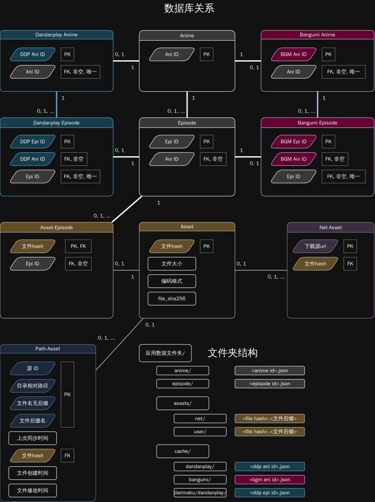

# 数据保存

> [!IMPORTANT]
>
> 项目目前有两条**独立**的数据库交互路径, 本文档仅描述**新版数据库结构**.
> [README_DATABASE_MIGRATION](./README_DATABASE_MIGRATION.md) 为旧的不动, 迁移向新的.
>
> 新数据库系统版本: v2

## 数据库关系结构

`nipaplay.db` 是新的主数据库.

设计原则是数据库尽量**不保存数据, 只保存关系**.
数据库通过各个实体的唯一 ID 为实体建立联系, 而实体的详细数据保存在外部 JSON 文件.

一图流总结:



---

### 各表一览

| No. | 表名                 | 中文名         | 说明                                         |
| --: | -------------------- | -------------- | -------------------------------------------- |
|   1 | `anime`              | (通用) 番剧表  | 关联不同信息系统的**番剧实体**               |
|   2 | `episode`            | (通用) 剧集表  | 关联不同信息系统的**剧集实体**               |
|   3 | `dandanplay_anime`   | 弹弹play番剧表 | 弹弹play番剧实体                             |
|   4 | `dandanplay_episode` | 弹弹play剧集表 | 弹弹play剧集实体                             |
|   5 | `bangumi_anime`      | Bangumi番剧表  | Bangumi番剧实体                              |
|   6 | `bangumi_episode`    | Bangumi剧集表  | Bangumi剧集实体                              |
|   7 | `asset`              | 资产表         | 大小, 时长, 编码等**资产文件本身具有的信息** |
|   8 | `path_asset`         | 资产路径表     | 保存资产在媒体源中的相对路径                 |
|   9 | `asset_episode`      | 资产剧集关联表 | 关联资产与剧集                               |
|  10 | `net_asset`          | 网络资源表     | 关联 URL 和资产                              |

- 所有表在创建时都使用 `STRICT` 模式.
- 连接数据库必须使用 `PRAGMA foreign_keys = ON;` 来启用外键约束.
- 除非特殊说明, 所有表示时间的字段都严格采用 `ISO 8601 / RFC 3339 格式.`

> [!NOTE]
>
> 关于 [ISO 8601 / RFC 3339](https://www.rfc-editor.org/rfc/rfc3339.html) 格式.
>
> 格式: `YYYY-MM-DDTHH:mm:ss±HH:mm` 或 `YYYY-MM-DDTHH:mm:ssZ`, 其中 `Z` 表示 UTC 时间, `±HH:mm` 表示时区偏移.
> 例如: `2024-06-01T12:34:56Z` 表示 UTC 时间, `2024-06-01T12:34:56+08:00` 表示北京时间.

#### Anime

| 字段       | 类型    | 约束                      |        |
| ---------- | ------- | ------------------------- | ------ |
| `anime_id` | INTEGER | PRIMARY KEY, CHECK( >= 0) | 人工键 |

#### Episode

| 字段         | 类型    | 约束                                     |                       |
| ------------ | ------- | ---------------------------------------- | --------------------- |
| `episode_id` | INTEGER | PRIMARY KEY, CHECK( >= 0)                | 人工键                |
| `anime_id`   | INTEGER | FOREIGN KEY, NOT NULL, ON DELETE CASCADE | 关联 `anime.anime_id` |

- 索引: `idx_episode_anime_id(anime_id)`.

> [!NOTE]
>
> `anime` 与 `episode` 是跨数据源的人工主键.
> DanDanPlay 和 Bangumi 记录通过引用同一个 `ani/epi id` **表达两者是同一动画/剧集**.
>
> 把所有 anime_id 和 episode_id 的外键引用设置为非空键,
> 每次往 dandanplay_anime/dandanplay_episode/bangumi_anime/bangumi_episode/asset_episode 插入新数据时,
> 必须先在 anime/episode 表中创建对应的记录.
>
> 这样将来如果需要引入新的数据源, 只要添加新表并引用通用表, 而不用修改原有字段.

#### Dandanplay Anime

| 字段                  | 类型    | 约束                                             | 说明                  |
| --------------------- | ------- | ------------------------------------------------ | --------------------- |
| `dandanplay_anime_id` | INTEGER | PRIMARY KEY, CHECK( >= 0)                        | 弹弹play 动画 ID      |
| `anime_id`            | INTEGER | FOREIGN KEY, NOT NULL, UNIQUE, ON DELETE CASCADE | 关联 `anime.anime_id` |

`anime_id` 唯一, 同一个共通 Anime 在 Dandanplay 表中最多对应一条记录.
其他表同理.

#### Dandanplay Episode

| 字段                    | 类型    | 约束                                             | 说明                                        |
| ----------------------- | ------- | ------------------------------------------------ | ------------------------------------------- |
| `dandanplay_episode_id` | INTEGER | PRIMARY KEY, CHECK( >= 0)                        | 弹弹play 剧集 ID                            |
| `dandanplay_anime_id`   | INTEGER | FOREIGN KEY, NOT NULL, ON DELETE CASCADE         | 关联 `dandanplay_anime.dandanplay_anime_id` |
| `episode_id`            | INTEGER | FOREIGN KEY, NOT NULL, UNIQUE, ON DELETE CASCADE | 关联 `episode.episode_id`                   |

- 外键: `dandanplay_anime_id -> dandanplay_anime.dandanplay_anime_id ON DELETE CASCADE`.
- 索引: `idx_dandanplay_episode_anime_id(dandanplay_anime_id)`.

#### `bangumi_anime`

| 字段               | 类型    | 约束                                             | 说明                  |
| ------------------ | ------- | ------------------------------------------------ | --------------------- |
| `bangumi_anime_id` | INTEGER | PRIMARY KEY, CHECK( >= 0)                        | Bangumi TV 动画 ID    |
| `anime_id`         | INTEGER | FOREIGN KEY, NOT NULL, UNIQUE, ON DELETE CASCADE | 关联 `anime.anime_id` |

#### `bangumi_episode`

| 字段                 | 类型    | 约束                                             | 说明                                  |
| -------------------- | ------- | ------------------------------------------------ | ------------------------------------- |
| `bangumi_episode_id` | INTEGER | PRIMARY KEY, CHECK( >= 0)                        | Bangumi TV 剧集 ID                    |
| `bangumi_anime_id`   | INTEGER | FOREIGN KEY, NOT NULL, ON DELETE CASCADE         | 关联 `bangumi_anime.bangumi_anime_id` |
| `episode_id`         | INTEGER | FOREIGN KEY, NOT NULL, UNIQUE, ON DELETE CASCADE | 关联 `episode.episode_id`             |

- 外键: `bangumi_anime_id -> bangumi_anime.bangumi_anime_id ON DELETE CASCADE`.
- 索引: `idx_bangumi_episode_anime_id(bangumi_anime_id)`.

> [!NOTE]
>
> Dandanplay 与 Bangumi 使用不同的关系表, 相互独立, 通过通用 `Anime/Episode` 表连接.

#### Asset

| 字段                 | 类型     | 约束         | 说明                                                |
| -------------------- | -------- | ------------ | --------------------------------------------------- |
| `asset_pre16mib_md5` | BLOB(16) | PRIMARY KEY  | **通过文件前 16 Mib 计算得到的 128 bit MD5 哈希值** |
| `asset_size`         | INTEGER  | CHECK( >= 0) | 文件大小                                            |
| `asset_codec`        | TEXT     | -            | 文件编码格式 (mp4, mkv, etc.)                       |
| `asset_sha256`       | BLOB(32) | -            | SHA-256 哈希值, 比 MD5 更安全 (将来或许会用到?)     |

#### Net-Asset

| 字段                 | 类型     | 约束                            | 说明                            |
| -------------------- | -------- | ------------------------------- | ------------------------------- |
| `net_url`            | TEXT     | PRIMARY KEY                     | 网络资源地址                    |
| `asset_pre16mib_md5` | BLOB(16) | FOREIGN KEY, ON DELETE SET NULL | 关联 `asset.asset_pre16mib_md5` |

- 索引: `idx_net_asset_asset_pre16mib_md5(asset_pre16mib_md5)`.

#### Path-Asset

| 字段                 | 类型     | 约束                                                 | 说明                           |
| -------------------- | -------- | ---------------------------------------------------- | ------------------------------ |
| `source_id`          | INTEGER  | NOT NULL, PRIMARY KEY(复合), DEFAULT 0, CHECK( >= 0) | 根据本字段读取配置文件         |
| `asset_address`      | TEXT     | NOT NULL, PRIMARY KEY(复合), DEFAULT ''              | 相对媒体源根地址的所在目录路径 |
| `asset_name_no_ext`  | TEXT     | NOT NULL, PRIMARY KEY(复合), DEFAULT ''              | 不带扩展名的文件名             |
| `asset_extension`    | TEXT     | NOT NULL, PRIMARY KEY(复合), DEFAULT ''              | 文件后缀                       |
| `updated_at`         | TEXT     | NOT NULL                                             | 更新时间                       |
| `asset_pre16mib_md5` | BLOB(16) | FOREIGN KEY, ON DELETE SET NULL                      | 关联资产                       |
| `asset_created_at`   | TEXT     | -                                                    | 资产创建时间                   |
| `asset_updated_at`   | TEXT     | -                                                    | 资产更新时间                   |

- 复合主键: `(source_id, asset_address, asset_name_no_ext, asset_extension)`.
- 外键: `asset_pre16mib_md5 -> asset.asset_pre16mib_md5 ON DELETE SET NULL`.
- 索引: `idx_path_asset_asset_pre16mib_md5(asset_pre16mib_md5)`.

> [!NOTE]
>
> 特殊的, source_id 为 `0` 的媒体源,
> 根路径固定为 `${XDG_DATA_HOME}/assets/`.
> 其他的编号的根路径和详细配置由用户设置.
>
> - `asset_address`: media/ani/2026-07/
> - `asset_name_no_ext`: AnimeName.S01E01
> - `asset_extension`: mp4

#### Asset-Episode

| 字段                 | 类型       | 约束                                        | 说明                            |
| -------------------- | ---------- | ------------------------------------------- | ------------------------------- |
| `asset_pre16mib_md5` | `BLOB(16)` | PRIMARY KEY, FOREIGN KEY, ON DELETE CASCADE | 关联 `asset.asset_pre16mib_md5` |
| `episode_id`         | `INTEGER`  | NOT NULL, FOREIGN KEY, ON DELETE CASCADE    | 关联 `episode.episode_id`       |

- 外键: `asset_pre16mib_md5 -> asset.asset_pre16mib_md5 ON DELETE CASCADE`.
- 索引: `idx_asset_episode_episode_id(episode_id)`.

虽然数据库不强制, 但原则上只有文件编码格式是视频格式的文件才可能会在 `asset_episode` 表中有记录.

---

## 跨平台存储目录结构

NipaPlay 通过 `StorageService` 统一确定应用数据及缓存目录. 业务代码应调用
该服务获取路径, 不要自行拼接平台目录.

### 应用数据根目录

`StorageService.getAppStorageDirectory()` 按以下规则选择根目录:

| 平台    | 目录规则                                                                |
| ------- | ----------------------------------------------------------------------- |
| Linux   | `${XDG_DATA_HOME}/NipaPlay`; 未设置时为 `~/.local/share/NipaPlay`       |
| Android | 优先使用可访问的用户自定义目录, 否则使用外部应用存储目录下的 `NipaPlay` |
| iOS     | `getApplicationDocumentsDirectory()` 返回的 Documents 目录              |
| macOS   | Documents 目录下的 `nipaplay`                                           |
| Windows | Documents 目录下的 `nipaplay`                                           |

Android 外部存储不可用, 目录不可访问或其他平台目录解析失败时, 会回退到
`getApplicationDocumentsDirectory()`; 除 iOS 外, 正常情况下会在其下创建
`nipaplay` 子目录.

Linux 会优先读取 `XDG_DATA_HOME`. 如果未设置, 则使用 `HOME` 计算默认路径.
无法创建 XDG 目录时才会最终回退到 Documents 目录.

### 主要目录结构

以下目录会在应用数据根目录下由 `StorageService` 按需创建:

```text
<应用数据根目录>/
├── cache/          -- JSON 缓存根目录
│   ├── danmaku/    -- 弹幕缓存
│   ├── dandanplay/ -- 弹弹play动画与剧集信息缓存
│   └── bangumi/    -- Bangumi动画与剧集信息缓存
│
├─── anime/         -- 用户番剧设置持久化存储 (封面图, 简介等)
├─── episode/       -- 用户单集设置持久化存储 (观看记录, 弹幕偏移等)
└─── assets/        -- 资产文件目录 (网络下载的封面图, 用户设置的封面等)
```

数据库, 日志, 图片缓存, 插件数据等模块也可能直接在应用数据根目录下创建
自己的文件或子目录, 因此实际内容可能比上表更多.

### JSON 文件存储

动画信息主要保存在应用数据目录中的 JSON 文件中.
这些 JSON 文件不属于 SQLite schema, **不受数据库事务和外键约束管理**.
使用 UTF-8 JSON 保存, 其中由 `saveJsonToFile()` 写入的对象使用 2 个空格缩进.

#### 应用数据目录下的 JSON 文件

| 路径                         | ID 含义               | 用途                                                                      |
| ---------------------------- | --------------------- | ------------------------------------------------------------------------- |
| `anime/{id}.json`            | Common Anime ID       | 通用 Anime JSON 数据. 当前由通用 JSON 写入函数支持, 具体字段由调用方决定. |
| `episode/{id}.json`          | Common Episode ID     | 通用 Episode JSON 数据, 同时保存 Dandanplay 匹配状态和弹幕偏移.           |
| `cache/dandanplay/{id}.json` | Dandanplay Anime ID   | Dandanplay Anime Package 缓存.                                            |
| `cache/bangumi/{id}.json`    | Bangumi Anime ID      | Bangumi Anime Package 缓存.                                               |
| `cache/danmaku/{id}.json`    | Dandanplay Episode ID | Dandanplay 弹幕 JSON 缓存的读取路径.                                      |

- `cache/dandanplay/{dandanplayAnimeId}.json` 保存 Dandanplay Anime Package.
- `cache/bangumi/{bangumiAnimeId}.json` 保存 Bangumi Anime Package.

> [!NOTE]
>
> 关于 Anime Package:
>
> Anime Package 表示一部番剧的**番剧信息及其所有剧集信息的集合**,
> 其典型 JSON 结构如下:
>
> ```json
> {
>   "anime": {
>     "anime_title": "XXXXXX",
>     "animeId": xxxxx,
>   },
>   "episodes": [
>     {
>       "ep": 1,
>       "episode_title": "XXXXXX",
>       "episode_id": xxxxx
>     },
>     {
>       "ep": 2,
>       "episode_title": "XXXXXX",
>       "episode_id": xxxxx
>     }
>   ]
> }
> ```

#### Common Episode JSON

`episode/{commonEpisodeId}.json` 是与共通 Episode 对应的可扩展 JSON 文件.
当前 Dandanplay 相关字段如下:

| 字段                  | 类型    | 用途                                                                          |
| --------------------- | ------- | ----------------------------------------------------------------------------- |
| `isMatchedDandanplay` | BOOLEAN | 是否已经通过 Dandanplay 文件匹配. 文件不存在或字段不是 `true` 时按未匹配处理. |
| `dandanplayOffset`    | NUMBER  | Dandanplay 弹幕偏移量.                                                        |

保存匹配状态或弹幕偏移时, 如果文件不存在会创建文件和父目录.
如果文件已经存在, 代码会读取 JSON, 更新对应字段后覆盖原文件.
因此同一个文件中可以保留其他未涉及的 JSON 字段.
文件内容不是主数据库 `dandanplay_episode` 表的列.

#### Dandanplay 弹幕 JSON

弹幕服务获取到的原始 JSON 会保存为 Dandanplay Episode 缓存.
读取逻辑查找:

`cache/danmaku/{dandanplayEpisodeId}.json`

`getDandanplayDanmakuByAssetHash()` 会先通过主数据库中的资产关系和
`dandanplay_episode` 关系定位 Dandanplay Episode, 再读取并解析该文件.
文件不存在或 JSON 格式无效时返回 `null`.

当前 `refreshDandanplayDanmakuCacheByEpisodeId()` 的实际写入路径为:

`cache/danmaku/dandanplay/{dandanplayEpisodeId}.json`

该路径与读取路径不同, 因此通过此函数刷新出的文件不会被
`getDandanplayDanmakuByAssetHash()` 按当前读取逻辑直接找到.
这是现有代码行为, 不是数据库约束.
